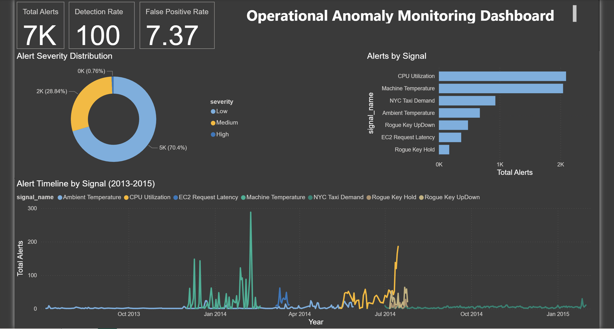

# Anomaly Detection Pipeline
### Time-Series Operational Monitoring using PySpark and Isolation Forest

Operational systems generate continuous streams of sensor data — server CPU usage, 
network latency, machine temperatures, taxi demand. When something goes wrong, 
it shows up as an anomaly in that data. Catching it early matters.

This project builds an end-to-end anomaly detection pipeline over 70,000+ 
real-world time-series records from the Numenta Anomaly Benchmark (NAB) dataset. 
The pipeline ingests data from 7 operational signals, engineers statistical 
features using PySpark, and applies a combination of Isolation Forest and 
statistical control charts to detect anomalous behavior. Chi-squared distributional 
tests are also computed and analyzed, though excluded from the final detection 
model due to high sensitivity on non-stationary signals.

## Key Results
- 100% anomaly event detection rate across all 19 known anomaly events
- 6.6% false positive rate on normal data
- Identified and resolved a model architecture flaw where combined training across heterogeneous signals degraded precision by 5x — fixed by switching to per-signal modeling

## Dashboard

## Signals Monitored
| Signal | Domain | Anomaly Type |
|--------|--------|--------------|
| Machine Temperature | Industrial | System failure prediction |
| CPU Utilization | Cloud | Misconfiguration detection |
| EC2 Request Latency | Cloud | System failure detection |
| Ambient Temperature | Environmental | Sensor anomaly detection |
| NYC Taxi Demand | Transportation | Demand spike detection |
| Rogue Key Hold/UpDown | Security | Behavioral anomaly detection |

## Project Structure

    anomaly-detection-pipeline/
    ├── anomaly_detection_pipeline.ipynb   
    ├── anomaly_scored_output.csv          
    ├── anomaly_detection_dashboard.pbix   
    ├── anomaly_detection_dashboard.pdf    
    ├── signal_overview.png                
    ├── dashboard_screenshot.png           
    └── README.md

## Pipeline Architecture
1. **Data Ingestion** — 7 real-world CSV signals loaded and tagged by source
2. **EDA** — visual inspection of signal behavior and anomaly window distribution
3. **Feature Engineering (PySpark)** — 13 features across short, medium, and long rolling windows
4. **Statistical Tests** — Chi-squared distributional tests and 3-sigma control charts
5. **Anomaly Detection** — per-signal Isolation Forest models (combined training reduced precision by 5x)
6. **Evaluation** — window-based detection rate against NAB ground truth labels
7. **Export** — scored output with severity classification for dashboard consumption

## Technical Stack
- **PySpark** — distributed feature engineering
- **Scikit-learn** — Isolation Forest anomaly detection
- **SciPy** — Chi-squared statistical tests
- **Pandas / NumPy** — data manipulation
- **Matplotlib** — signal visualization
- **Power BI** — operational monitoring dashboard

## Dataset
[Numenta Anomaly Benchmark (NAB)](https://github.com/numenta/NAB) — a public 
benchmark dataset containing real-world time-series data with known anomaly 
windows across multiple domains including cloud infrastructure, industrial 
sensors, and transportation.
